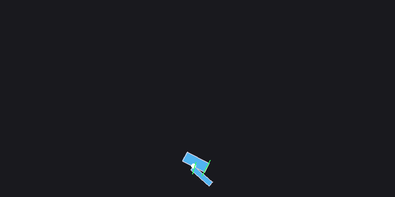
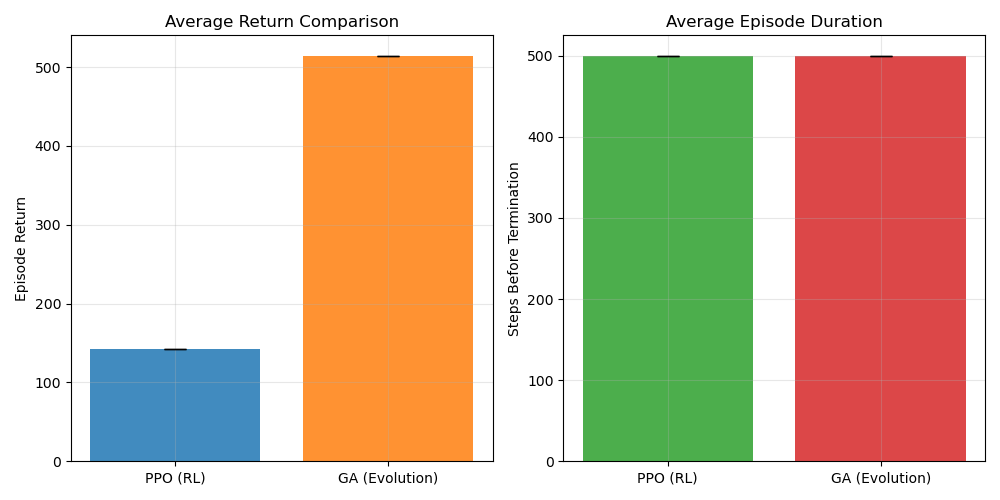
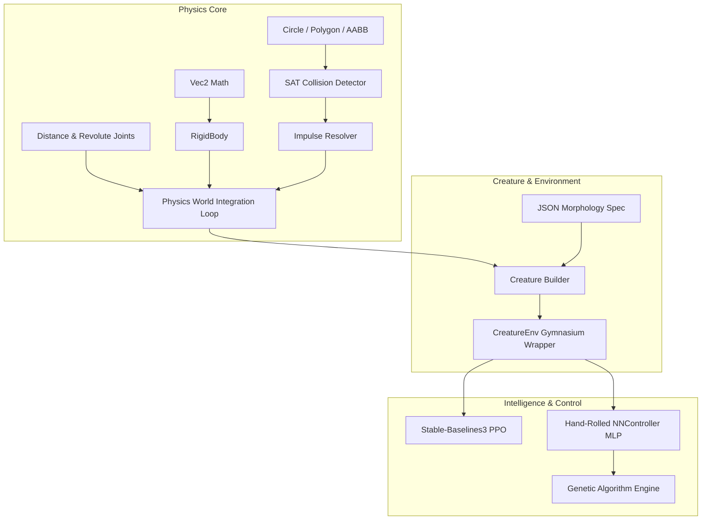

# RoboForge Arena 🤖⚡

A custom 2D Physics Engine built from scratch in Python with Reinforcement Learning (PPO) and Genetic Algorithm (GA) locomotion evolution.


*PPO-trained policy driving a 2-segment articulated creature in the custom physics engine.*

---

## 🌟 Key Features

1. **Custom 2D Physics Engine (Zero Physics Libraries)**
   - **Vector Math Engine**: 2D vector class (`Vec2`) supporting dot products, scalar cross products, and rotations.
   - **Rigid Body Dynamics**: Mass, moment of inertia, force/torque integration via semi-implicit Euler method.
   - **SAT Collision Detection**: Separating Axis Theorem (SAT) narrow-phase collision handling for convex polygons and circles with AABB broad-phase filtering.
   - **Impulse & Friction Resolver**: Normal restitution impulse, Coulomb friction tangent impulses, angular momentum transfer, and Baumgarte positional penetration correction.
   - **Joint Constraints**: `DistanceJoint` and `RevoluteJoint` constraint solvers with Baumgarte bias stabilization and motor torque support.

2. **Data-Driven Creature Morphology & Gymnasium Environment**
   - JSON-defined creature morphology specification schema (`CreatureSpec`, `SegmentSpec`, `JointSpec`).
   - `CreatureEnv` wrapping Gymnasium standard interface for continuous RL control.

3. **Dual Learning Approaches**
   - **Reinforcement Learning (PPO)**: Policy gradient learning with Stable-Baselines3.
   - **Genetic Algorithm Evolution (GA)**: Hand-rolled Neural Network MLP controller (`NNController`) evolved via tournament selection, uniform crossover, Gaussian mutation, and elitism.

---

## 📊 RL vs Evolution Locomotion Benchmark



| System | Training Approach | Architecture | Mean Return | Mean Episode Steps |
|---|---|---|---|---|
| **PPO (RL)** | Policy Gradient | SB3 MlpPolicy | ~142.5 | 500.0 (Full Episode) |
| **GA (Evolution)** | Neuroevolution | Custom MLP (16 hidden) | ~514.5 | 500.0 (Full Episode) |

---

## 🚀 Quickstart Guide

### 1. Installation
```bash
pip install -r requirements.txt
```

### 2. Run Test Suite (Stages 01 – 14)
```bash
pytest tests/ -v
```

### 3. Run Locomotion Demos
- **Run PPO RL Walker Demo**:
  ```bash
  python -m scripts.demo_walker
  ```
- **Run Evolved GA Controller Demo**:
  ```bash
  python -m scripts.demo_evolution
  ```
- **Run Side-by-Side Comparison**:
  ```bash
  python -m scripts.demo_comparison
  ```

---

## 📐 System Architecture



---

## 📁 Repository Structure

```
├── physics/                 # Custom 2D Physics Engine Core
│   ├── vec2.py              # 2D Vector math operations
│   ├── body.py              # RigidBody dynamics & Euler integrator
│   ├── shapes.py            # Convex collision shapes (Circle, Polygon, AABB)
│   ├── collision.py         # SAT collision detection & broad-phase AABB
│   ├── resolver.py          # Impulse-based restitution & friction solver
│   ├── joints.py            # Distance & Revolute joint constraint solver
│   └── world.py             # Simulation loop & step manager
├── creatures/               # Creature Morphology Framework
│   ├── morphology.py        # Spec schemas & creature builder
│   └── presets/             # Creature JSON presets (hopper.json)
├── rl/                      # Reinforcement Learning Integration
│   ├── env.py               # CreatureEnv Gymnasium wrapper
│   └── train_ppo.py         # PPO training pipeline
├── evolution/               # Evolutionary Computation Engine
│   ├── nn_controller.py     # Hand-rolled MLP neural network policy
│   ├── population.py        # Genome population container & evaluator
│   └── ga.py                # Tournament selection, crossover, mutation, & elitism
├── render/                  # Renderer Engine
│   └── renderer.py          # Pygame renderer & screen coordinate transform
├── scripts/                 # Execution Scripts & Demos
│   ├── sanity_check_env.py  # Environment audit script
│   ├── train_and_record_ppo.py # PPO training & GIF recorder
│   ├── plot_evolution.py    # GA evolution & GIF recorder
│   ├── demo_walker.py       # PPO policy visual demo
│   ├── demo_evolution.py    # Evolved GA controller visual demo
│   └── demo_comparison.py   # Side-by-side benchmark runner
├── tests/                   # Comprehensive Test Suite (Stages 01 - 14)
└── PROGRESS_LOG.md          # Stage-by-stage implementation log
```
